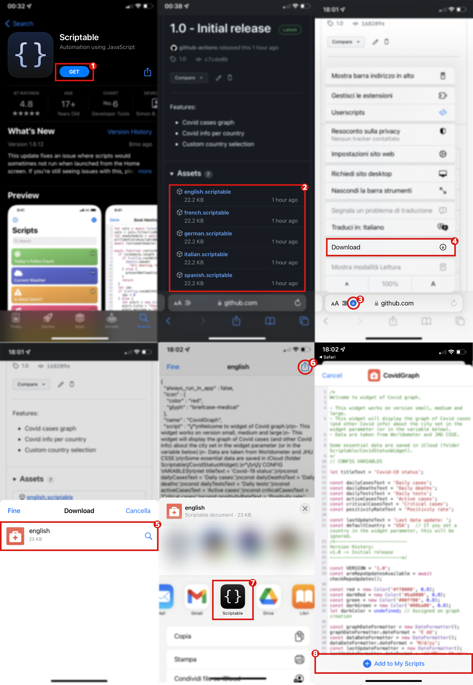

## How to install

1. Download Scriptable from the App Store.
2. **Download** a Scriptable file from the [release page](https://github.com/Hider-alt/covid-widget/releases/latest).
3. Once downloaded, click the Share button.
4. Click on the Scriptable icon.
5. Click on "Add to My Scripts".
6. Click on "Done".